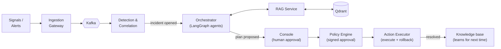

<div align="center">

# 🛡️ Aegis

### Autonomous Incident Response & Remediation Platform

**AI agents detect, diagnose, and fix production incidents — with a human approving every action.**

[](#)
[](#license)
[](#)

</div>

---

## What it does

When production breaks, most of the delay isn't fixing the problem — it's figuring out *what broke and why*.
Aegis compresses that loop: it correlates raw alerts into a single incident, runs a team of LLM agents that
diagnose root cause using RAG over runbooks and past incidents, proposes a fix from a governed action
catalog, and — only after a human approves — executes it and rolls back automatically on failure.

Built as a full distributed system, not a script: 9 microservices, an event-driven Kafka backbone, a
multi-agent LangGraph workflow, and a zero-trust remediation path with signed approvals and idempotent execution.

## Architecture



## Highlights

- **Multi-agent AI workflow** — LangGraph state machine (Triage → Investigate → Recommend), grounded in
  real evidence via RAG, with confidence-based abstention instead of guessing.
- **Event-driven microservices** — Kafka backbone, partition-key design for correlation and ownership,
  at-least-once delivery with idempotent consumers.
- **Zero-trust remediation** — agents can only *propose* actions from a fixed catalog; a human approves;
  approvals are cryptographically signed and independently verified before anything executes.
- **Distributed-systems safety** — fencing tokens prevent split-brain execution, saga rollback undoes
  partial failures, circuit breakers and per-incident budgets stop runaway agent loops.
- **Production-style ops** — Docker (hardened, non-root), Kubernetes manifests, OpenTelemetry tracing
  across every service and agent step.
- **21 documented architecture decisions** — every major design choice, alternative, and trade-off is
  recorded in [`docs/adr/`](docs/adr).

## Tech Stack

| Layer | Technology |
|---|---|
| Backend | Python, FastAPI, SQLAlchemy (async) |
| Data | PostgreSQL, Redis |
| Messaging | Apache Kafka |
| AI / Agents | LangGraph, LangChain, RAG, Qdrant |
| Infra | Docker, Kubernetes |
| Observability | OpenTelemetry, Jaeger |

## Quick Start

```bash
git clone <repo-url> aegis && cd aegis
make install-ai-extra
make up-all && make db-init && make seed-runbooks
make demo                          # drives a sample incident end-to-end
curl localhost:8002/incidents      # see the result
```

Full setup, API reference, and design docs: see [`OPERATIONS.md`](OPERATIONS.md), [`architecture.md`](architecture.md), and [`docs/adr/`](docs/adr).

## What this project demonstrates

Distributed systems (CAP trade-offs, idempotency, distributed ownership) · event-driven architecture ·
multi-agent LLM orchestration · RAG · microservices · security engineering (signed approvals, zero-trust
execution) · Kubernetes/Docker · observability · systems design documentation (ADRs).

## Status

Reference implementation — the full control flow (ingest → agents → approval → execution → learning) runs
end-to-end locally. See [`AUDIT.md`](AUDIT.md) for an honest breakdown of what's production-hardened vs. in progress.

## License

MIT — see [LICENSE](LICENSE).
