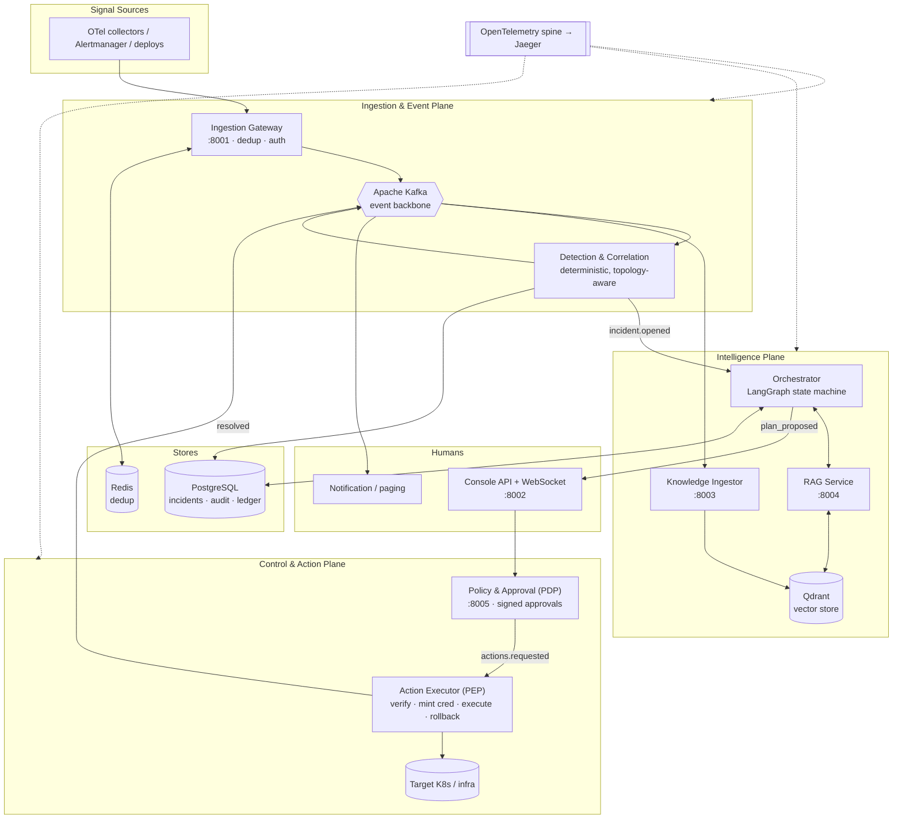
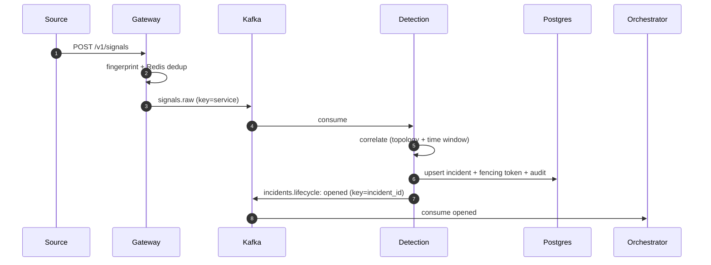
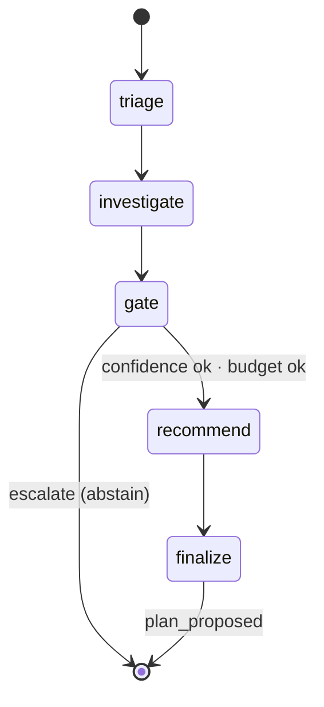
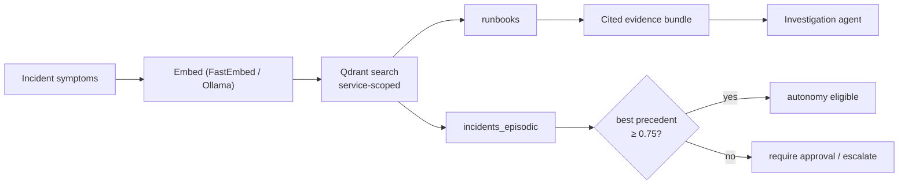

<div align="center">

# 🛡️ Aegis

### Autonomous Incident Response & Remediation Platform — *Agentic AIOps*

**Ingest live observability signals → correlate into incidents → diagnose root cause grounded in your runbooks → propose a remediation plan → execute it under a human approval gate → verify and learn.**

[](#-project-status--honest-limitations)
[](#)
[](docs/adr)
[](#-license)
[](#)

*Distributed systems · Event-driven architecture · Multi-agent LLM orchestration · RAG · Zero-trust action path*

</div>

---

## Table of Contents

- [Project Overview](#-project-overview)
- [Architecture Overview](#-architecture-overview)
- [Key Features](#-key-features)
- [Technology Stack](#-technology-stack)
- [System Design Highlights](#-system-design-highlights)
- [User Journey](#-user-journey)
- [Installation](#-installation)
- [Running Locally](#-running-locally)
- [Running the Demo](#-running-the-demo)
- [API Documentation](#-api-documentation)
- [LangGraph Workflow](#-langgraph-workflow)
- [RAG Architecture](#-rag-architecture)
- [Security Model](#-security-model)
- [Reliability Features](#-reliability-features)
- [Testing](#-testing)
- [Screenshots & Demos](#-screenshots--demos)
- [Project Status & Honest Limitations](#-project-status--honest-limitations)
- [Resume Impact](#-resume-impact)
- [Future Roadmap](#-future-roadmap)
- [Contributing](#-contributing)
- [License](#-license)

---

## 🎯 Project Overview

### The problem

When a production system breaks, **detection is rarely the bottleneck — diagnosis and remediation are.**
Alerting is mature; the expensive minutes are spent by a human on-call engineer manually correlating
signals across dashboards, searching runbooks, recalling how a similar incident was resolved months ago,
and cautiously applying a fix. That work is slow, inconsistent between responders, dependent on tribal
knowledge that leaves with people, and corrosive (3 a.m. pages drive burnout).

### Why it matters

Downtime on revenue-critical services is frequently costed in **thousands of dollars per minute**, and
Mean Time To Resolution (MTTR) for non-trivial incidents is dominated by *human investigation*, not the
fix itself. Every minute shaved off the investigate → diagnose → fix → verify loop has direct business value.

### Why Aegis exists

Aegis is an autonomous, multi-agent platform that **compresses that loop** while keeping a human in command
of consequential actions. It correlates raw signals into a single incident, runs a team of LLM agents that
diagnose root cause **grounded in your own runbooks and past incidents** (RAG), proposes a remediation plan
from a **governed catalog**, and — subject to policy-driven human approval — executes that plan idempotently
with automatic rollback, then feeds the resolution back into its knowledge base.

It is deliberately **not** a chatbot, a doc-Q&A toy, or a dashboard. The agents take *consequential actions
on infrastructure*, which is exactly what makes the distributed-systems and safety engineering hard — and
interesting.

### Business value

| Lever | Mechanism |
|---|---|
| **Reduced MTTR** | Agents parallelize correlation, RCA, and runbook retrieval that a human does serially |
| **Knowledge retention** | Every resolved incident becomes queryable episodic memory; tribal knowledge stops walking out the door |
| **Consistency & auditability** | Every decision and action is policy-gated, traced, and written to a tamper-evident audit log |
| **On-call quality of life** | Agents handle triage and known-pattern remediation; humans handle judgment calls |
| **Safety by construction** | The platform degrades to deterministic paging and can never make an incident worse without human sign-off |

---

## 🏗️ Architecture Overview

Aegis is a monorepo of a shared library (`aegis_common`) plus **nine independently deployable services**
that share one container image (the entrypoint selects which service runs — ADR-013). Three logical planes:
an **ingestion/event plane**, an **intelligence (agent) plane**, and a **control/action plane**, over a
cross-cutting observability + security spine.



### Component explanations

| Service | Plane | Responsibility |
|---|---|---|
| **Ingestion Gateway** | ingest | OTLP/Alertmanager intake, token auth, Redis content-hash dedup, publish to `signals.raw` |
| **Detection & Correlation** | ingest | normalize signals, deterministic topology+time correlation into incidents, issue fencing token |
| **Orchestrator** | intel | run the LangGraph agent workflow; produce a durable, cited remediation plan |
| **RAG Service** | intel | grounded retrieval over runbooks + episodic incidents; compute the autonomy precedent gate |
| **Knowledge Ingestor** | intel | embed runbooks and resolved incidents into Qdrant (closed-loop learning) |
| **Policy & Approval (PDP)** | control | evaluate autonomy policy, record HMAC-signed immutable approvals |
| **Action Executor (PEP)** | control | independently verify approval, mint scoped credentials, execute idempotently, saga-rollback |
| **Notification** | UX | fan out lifecycle events / paging with deep links |
| **Console API** | UX | REST + WebSocket operator console; live incident timeline |

### Event flow



### Agent flow



### RAG flow



---

## ✨ Key Features

- **Incident Correlation** — deterministic, topology- and time-aware grouping of many signals into one
  incident (not N alerts). Severity escalates to the most severe contributing signal. Pure, unit-tested logic
  (ADR-018).
- **Event-Driven Architecture** — services are loosely-coupled producers/consumers; new capabilities subscribe
  without touching producers. Lifecycle is an event stream.
- **Kafka Backbone** — partition keys are a *correctness* decision: `signals.*` by service (correlation
  locality), `incidents.lifecycle` and `actions.*` by `incident_id` (single-driver ownership). At-least-once
  with idempotent consumers (ADR-002/005).
- **LangGraph Agents** — a supervised state machine (Triage → Investigation → Recommendation) over a typed,
  checkpointed `IncidentState` blackboard. Deterministic and inspectable, not free-form chat (ADR-003).
- **RAG System** — grounded retrieval over your runbooks and past incidents; every hypothesis carries
  citations; no ungrounded action proposals (ADR-016).
- **Qdrant Vector Search** — three collections (`runbooks`, `incidents_episodic`, `architecture_docs`) with
  service-scoped metadata filtering and cosine similarity (ADR-008).
- **Human-in-the-Loop Approval** — the workflow halts at `plan_proposed`; a human approves/rejects via the
  console before anything executes above the lowest risk tier (ADR-007).
- **Governed Remediation** — agents may only request actions from a catalog (`restart_deployment`,
  `scale_replicas`, `rollback_revision`, `clear_cache`), each with a risk tier, JSON-schema params, and a
  rollback definition. Out-of-catalog actions are structurally impossible.
- **PDP/PEP Security Model** — Policy Decision Point (approves & signs) is split from the Policy Enforcement
  Point (independently verifies & executes). The executor never trusts the caller's word (ADR-014).
- **OpenTelemetry Observability** — every service and agent step emits spans; a single `trace_id` follows an
  incident from ingest to resolution (Jaeger UI at `:16686`).
- **Circuit Breakers** — the LLM, RAG, and infra clients are wrapped so a failing dependency degrades
  gracefully instead of cascading (ADR-017).
- **Saga Rollbacks** — multi-step remediation is transactional; on failure, applied reversible steps are
  compensated in reverse order (FR-5.4).
- **Fencing Tokens** — a monotonic Postgres sequence issues a token per incident; the executor refuses to act
  on a stale token, defeating split-brain on the dangerous path (ADR-009).

---

## 🧰 Technology Stack

| Layer | Technology | Why |
|---|---|---|
| **Backend** | Python 3.11, FastAPI, Uvicorn, Pydantic v2, SQLAlchemy 2 (async), asyncio | Typed, async, modern web + data layer |
| **Databases** | PostgreSQL 16 (asyncpg + Alembic), Redis 7 | System of record + advisory dedup/cache |
| **Messaging** | Apache Kafka 3.8 (KRaft, no ZooKeeper), aiokafka | Partitioned, replayable event backbone |
| **AI / Agents** | LangGraph, LangChain-core, Ollama-compatible LLMs, FastEmbed (ONNX) | Multi-agent orchestration + OSS-first models |
| **Vector Search** | Qdrant 1.12 | Payload-filtered hybrid-capable vector store |
| **Infrastructure** | Docker (multi-stage, non-root), Kubernetes + Kustomize, HPA | Cloud-agnostic, Kubernetes-first |
| **Observability** | OpenTelemetry SDK + OTLP, Jaeger | Distributed tracing across services and agents |
| **Security** | HMAC-signed approvals, scoped capability tokens, NetworkPolicy, RBAC-ready catalog | Zero-trust action path |

> **OSS-first (ADR-010):** open-source / Ollama-compatible models are the default; a model router escalates
> only the hardest reasoning. Everything runs on free, self-hostable components.

---

## 🧪 System Design Highlights

These are the decisions a distributed-systems interviewer tends to probe. Each is captured as an ADR in
[`docs/adr/`](docs/adr).

- **CAP theorem decisions (ADR-004).** The *action path is CP*: if Aegis cannot confirm it holds the incident
  and a fresh fencing token, it refuses to act and pages a human — never double-remediate under partition.
  The *read/observability path is AP*: the console may serve slightly stale state rather than block.
- **At-least-once delivery (ADR-005).** Consumers commit offsets only after successful handling; handlers are
  idempotent (e.g. `signal_id` primary key, content-hash dedup, a unique action ledger key).
- **Transactional outbox (ADR-012).** *Designed* to make the DB-write + Kafka-publish atomic. **See
  [limitations](#-project-status--honest-limitations) — the current code does a dual-write; the outbox relay
  is the top backlog item.** Called out rather than hidden.
- **Idempotency.** Every command carries an idempotency key; the executor's `actions_ledger` has a unique
  `(incident_id, step_id, fencing_token)` constraint so a redelivered action is a no-op.
- **Distributed ownership (ADR-009).** Single-driver semantics come from Kafka single-consumer-per-partition
  on `incidents.lifecycle`; the dangerous path is additionally guarded by a *linearizable* Postgres-sequence
  fencing token — not a Redis lock (the v1.0 Redlock design was rejected after review).
- **Reliability mechanisms.** Circuit breakers, per-incident budgets (iterations / wall-clock / tokens),
  optimistic concurrency (`version` column), and saga compensation.

---

## 🚶 User Journey

`Alert → Incident → Investigation → RAG Retrieval → Recommendation → Approval → Remediation → Resolution → Knowledge Ingestion`

1. **Alert.** A monitor POSTs to the Ingestion Gateway (`/v1/signals` or `/v1/alerts/alertmanager`). The
   gateway authenticates, fingerprints the signal, drops duplicates via Redis, and publishes to `signals.raw`.
2. **Incident.** Detection normalizes the signal and runs deterministic correlation: it attaches to an open,
   topology-adjacent incident or opens a new one — assigning a fencing token, writing a hash-chained audit
   record, and emitting `incidents.lifecycle: opened`. Notification pages a human (works with zero AI).
3. **Investigation.** The Orchestrator consumes `opened` and runs the LangGraph workflow. The Triage agent
   sets severity/services; the Investigation agent queries RAG.
4. **RAG Retrieval.** The RAG Service embeds the symptoms, searches Qdrant (service-scoped) over runbooks and
   past incidents, and returns a cited evidence bundle plus a `has_precedent` flag.
5. **Recommendation.** The gate applies safety checks (confidence floor, precedent gate, budget). If it
   passes, the Recommendation agent maps the diagnosis to an ordered plan of governed catalog actions; the
   plan is persisted and `plan_proposed` is emitted. If not, the workflow **abstains and escalates**.
6. **Approval.** The operator sees the plan (with per-step risk tiers and dispositions) in the console and
   approves. The console forwards to the PDP, which records an HMAC-signed, immutable approval and emits
   `actions.requested`.
7. **Remediation.** The Action Executor independently verifies the signature, confirms the fencing token is
   current, mints a scoped capability per namespace, validates params against the catalog schema, and
   executes idempotently — running saga rollback on any failure.
8. **Resolution.** On success the incident is marked resolved and `resolved` is emitted.
9. **Knowledge Ingestion.** The Knowledge Ingestor consumes `resolved` and embeds the incident into episodic
   memory, so the next similar incident retrieves it as precedent.

---

## 📦 Installation

**Prerequisites:** Docker + Docker Compose, Python 3.11, ~4 GB free RAM (Kafka + Qdrant + Postgres), and
outbound internet for PyPI/images. Optional: Ollama for real LLM/embeddings; a Kubernetes cluster for real
remediation.

```bash
git clone <your-fork-url> aegis && cd aegis
python3 -m venv .venv && source .venv/bin/activate
make install-ai-extra          # pip install -e ".[dev,ai,k8s]"
```

---

## 🖥️ Running Locally

```bash
make up-all       # build + start infra (Postgres, Redis, Kafka, Qdrant, OTel, Jaeger) + all 9 services
make db-init      # create schema + fencing sequence + seed action catalog & policy
make seed-runbooks  # load demo runbooks into Qdrant so RAG has grounding

# health check all HTTP services
for p in 8001 8002 8003 8004 8005; do curl -s localhost:$p/healthz; echo; done
```

Run a single service on the host (infra in Docker) for debugging:

```bash
make infra-up && make db-init
make run-ingestion   # or: run-detection run-rag run-knowledge run-orchestrator
                     #     run-policy run-executor run-notification run-console
```

> **Offline by default (ADR-021):** without Ollama/Qdrant/K8s the platform auto-selects deterministic offline
> backends (a rule-based LLM, a hashing embedder) and a dry-run action runtime. The *entire control flow*
> runs end-to-end; only model quality and real cluster mutation are stubbed. Start Ollama with
> `docker compose --profile models up -d ollama` and set `AEGIS_K8S_ENABLED=true` for the real thing.

---

## ▶️ Running the Demo

```bash
make demo          # sends 4 signals: api alert, a duplicate, an adjacent db alert, an unrelated payments alert
```

Expected: `{"accepted": 3, "deduplicated": 1}` — the duplicate is dropped; the api + db alerts collapse into
**one** incident via topology correlation; payments is a **separate** incident.

```bash
curl -s localhost:8002/incidents | jq            # list incidents
curl -s localhost:8002/plans/pending | jq        # plans awaiting approval

# approve a plan (copy a plan_id from above)
curl -s -XPOST localhost:8002/plans/decision \
  -H 'content-type: application/json' \
  -d '{"plan_id":"<PLAN_ID>","decision":"approved","approver":"maya"}' | jq

curl -s localhost:8002/incidents/<INCIDENT_ID> | jq   # status → "resolved"
open http://localhost:16686                            # Jaeger: one trace per incident
```

---

## 📡 API Documentation

| Service | Port | Method | Endpoint | Description |
|---|---|---|---|---|
| Ingestion Gateway | 8001 | POST | `/v1/signals` | Ingest canonical signals (`x-aegis-token` header) |
| | | POST | `/v1/alerts/alertmanager` | Alertmanager webhook → signals |
| | | GET | `/healthz`, `/readyz` | Liveness / readiness |
| Console API | 8002 | GET | `/incidents?status=&limit=` | List incidents |
| | | GET | `/incidents/{id}` | Incident detail + signals |
| | | GET | `/plans/pending` | Plans awaiting approval (proxies PDP) |
| | | POST | `/plans/decision` | Approve/reject `{plan_id, decision, approver}` |
| | | WS | `/ws/incidents` | Live lifecycle event stream |
| | | GET | `/healthz` | Liveness |
| Knowledge Ingestor | 8003 | POST | `/v1/runbooks` | Ingest a runbook `{source, service, system, text, tags}` |
| | | GET | `/healthz` | Liveness |
| RAG Service | 8004 | POST | `/v1/retrieve` | Grounded retrieval → hits + `has_precedent` |
| | | GET | `/healthz`, `/readyz` | Liveness / readiness |
| Policy & Approval (PDP) | 8005 | GET | `/v1/plans/pending` | Pending plans + per-step dispositions |
| | | GET | `/v1/plans/{id}` | Plan detail |
| | | POST | `/v1/plans/{id}/decision` | Record signed approval; emit `actions.requested` |
| | | GET | `/healthz` | Liveness |

Workers (no HTTP surface): **detection**, **orchestrator**, **action_executor**, **notification**.

---

## 🧠 LangGraph Workflow

The Orchestrator compiles a `StateGraph` over a typed `IncidentState` (a checkpointed blackboard). Nodes and
transitions, exactly as implemented in `orchestrator/graph.py`:

| Node | Type | What it does |
|---|---|---|
| `triage` | agent | Sets severity, affected services, urgency from the signals |
| `investigate` | agent | Calls RAG for grounding; forms a **cited** root-cause hypothesis with a confidence score |
| `gate` | control | Applies safety gates (below); routes to `recommend` or escalates |
| `recommend` | agent | Maps the diagnosis to an ordered plan of governed catalog actions |
| `finalize` | control | Marks `decision = plan_ready` |

**Transitions:** `triage → investigate → gate`; then a conditional edge — `gate → recommend → finalize → END`
(plan proposed) **or** `gate → END` (escalated). The gate escalates when **any** of:

- budget exhausted (iterations / wall-clock / tokens) — ADR-017;
- confidence `< 0.4` (abstain rather than guess) — ADR-016;
- otherwise `autonomy_allowed = has_precedent AND confidence ≥ 0.7`, and steps above the lowest risk tier
  still require human approval.

Checkpointing uses LangGraph's `MemorySaver` within a run; a durable `WorkflowSnapshot` is persisted at the
end. Execution is intentionally **not** a graph node — it lives behind the PDP/PEP services, so `plan_proposed`
*is* the human-in-the-loop interrupt point.

---

## 🔎 RAG Architecture

- **Chunking** (`chunking.py`) — structure-aware: splits runbooks on markdown headings / `Step N` markers,
  then size-bounds each section with overlap, so a matched chunk is a coherent procedure step.
- **Embeddings** (`embeddings.py`) — an `Embedder` protocol with three backends selected by availability:
  `FastEmbedEmbedder` (local ONNX, default), `OllamaEmbedder` (server), and a deterministic `HashingEmbedder`
  fallback for offline CI. The chosen dimension drives Qdrant collection creation.
- **Retrieval** (`retrieval.py`) — embeds the query, searches Qdrant with **service-scoped metadata filters**
  over both `runbooks` and `incidents_episodic`, and assembles a citation-bearing `EvidenceBundle`.
- **Similarity search** — cosine distance over HNSW; episodic hits are sorted by score so the strongest past
  incident is the candidate precedent.
- **Precedent gate (ADR-016)** — `precedent_gate()` returns true only when the best episodic match scores
  `≥ 0.75`. This is the hard rule behind autonomy: **no auto-remediation without a sufficiently similar,
  validated past incident.** Otherwise the agents abstain and a human is asked.

---

## 🔐 Security Model

A zero-trust action path where **no LLM output can ever directly trigger an action** (ADR-015) — actions come
only from the governed catalog, schema-validated, behind the gate.

- **Approval signatures (ADR-014).** When a human approves, the PDP computes an **HMAC-SHA256** signature over
  the canonical approval record (`plan_id`, `incident_id`, `decision`, `approver`, `fencing_token`) and stores
  it immutably. The Action Executor (PEP) **independently re-verifies** that signature before doing anything —
  it does not trust the message that told it to act.
- **Capability tokens.** The executor mints a short-lived, namespace-scoped `Capability` (signed, expiring)
  per step. The runtime rejects any action whose namespace is outside the capability's scope, and an expired
  or tampered capability fails verification.
- **Fencing tokens (ADR-009).** A monotonic Postgres sequence issues a token per incident. The PEP confirms
  the approval's token still matches the incident's current token, so a superseded owner cannot execute.
- **Policy engine (ADR-007).** A pure PDP evaluates autonomy mode (`observe` / `suggest` / `auto_low`) ×
  step risk tier × precedent to a disposition (`auto_approve` / `require_approval`). `observe` and `suggest`
  never auto-execute; `auto_low` auto-approves only low-risk, precedent-backed steps.
- **Audit (ADR-014).** Every decision/action is appended to a **hash-chained** audit log (`hash_n =
  SHA256(seq ‖ prev_hash ‖ payload)`), so retroactive edits are detectable by recomputation.
- **Hardening.** Containers run non-root with read-only rootfs and dropped capabilities; a default-deny
  `NetworkPolicy` restricts traffic to intra-namespace; a `AUTONOMY_MODE` kill switch drops to observe/suggest
  instantly (ADR-019).

---

## 🛟 Reliability Features

- **Circuit breakers (ADR-017).** `CircuitBreaker` (closed → open → half-open with cooldown) wraps the LLM,
  RAG, and infra clients. A tripped breaker rejects fast instead of cascading; it probes recovery after a
  cooldown. Unit-tested.
- **Retries & budgets.** Cross-service calls use bounded retries; each incident has a hard budget (iterations,
  wall-clock, tokens) that escalates to a human on exhaustion — bounding both cost and the Diagnose↔Verify
  oscillation risk.
- **Dead-letter queues.** DLQ topics (`signals.raw.dlq`, `incidents.lifecycle.dlq`) are provisioned for
  poison-message capture. **Status:** topics exist; routing failed messages to them is on the backlog (see
  limitations).
- **Saga rollback (FR-5.4).** Multi-step plans are applied in order; on any failure, previously-applied
  reversible steps are compensated in reverse using their catalog `rollback_action`, and the incident is
  escalated.

---

## ✅ Testing

```bash
make test               # unit suite (pytest)
make test-integration   # end-to-end, against a running stack (AEGIS_RUN_INTEGRATION=1)
make lint               # ruff + mypy
```

- **Unit tests** — pure, infrastructure-free logic: correlation rules, signal fingerprint/dedup, the
  hash-chain (incl. tamper detection), circuit breaker + budget, approval signing + capability expiry, PDP
  policy decisions, RAG retrieval + precedent gate (fake store), chunking, and the agent pipeline driven by
  the deterministic offline LLM.
- **Integration / End-to-end tests** — `tests/integration/test_e2e_remediation.py` drives the full lifecycle
  against the live stack: ingest → incident → plan proposed → approve → executed → resolved. Gated behind
  `AEGIS_RUN_INTEGRATION=1` so the default unit run needs no infrastructure.

---

## 📸 Screenshots & Demos

> Placeholders — add captures from your local run.

| View | Placeholder |
|---|---|
| Incident console (live timeline) | `docs/media/console.png` |
| Pending plan + approval | `docs/media/approval.png` |
| Jaeger trace (ingest → resolve) | `docs/media/trace.png` |
| End-to-end demo | `docs/media/demo.gif` |

```text
[ docs/media/demo.gif ]  ← record `make demo` + the approval curl + the resolved incident
```

---

## 📋 Project Status & Honest Limitations

This is a **reference implementation** built to demonstrate the architecture end-to-end. The control flow,
safety gates, PDP/PEP, RAG, and agent graph are real and tested. In the spirit of an honest engineering
README, the open items (tracked in [`AUDIT.md`](AUDIT.md)) are:

- **Transactional outbox not yet implemented** — services currently dual-write to Postgres + Kafka; a crash
  between them risks a lost/phantom event. *Top backlog item.*
- **DLQ producers** — topics exist; failed messages aren't routed to them yet, and the Kafka commit path
  should be hardened so a failing message can't be skipped.
- **Verifier step (FR-5.5)** — the executor marks `resolved` on action success; it does not yet re-check the
  originating signals recovered.
- **Metrics export** — domain metrics are defined but a `MeterProvider`/OTLP exporter isn't wired, so only
  traces currently flow.
- **Quality vs. control flow** — offline adapters validate *control flow and safety*, not RCA accuracy. The
  precedent-gate thresholds need calibration against a real model with a historical-replay eval.

These are deliberately surfaced; none are hidden behind green checkmarks.

---

## 💼 Resume Impact

Building Aegis exercises — with working code, not slideware — the following senior-level concepts:

- **Distributed systems:** partitioned single-writer ownership, linearizable fencing tokens, idempotency,
  optimistic concurrency, CAP trade-offs on a per-path basis, saga compensation.
- **Event-driven architecture & microservices:** Kafka topic/partition-key design as a correctness concern,
  at-least-once semantics, loosely-coupled services behind a shared contract library.
- **AI engineering:** a supervised multi-agent LangGraph workflow, RAG with structure-aware chunking and
  precedent-gated autonomy, OSS-first model abstraction, prompt-injection-resistant design (the catalog +
  HITL boundary), and per-incident cost/loop budgets.
- **Backend engineering:** async FastAPI services, SQLAlchemy 2 async + Alembic, clean hexagonal seams
  (every external dependency behind a swappable adapter).
- **Security engineering:** PDP/PEP separation, HMAC-signed approvals with independent verification, scoped
  capability tokens, hash-chained tamper-evident audit, zero-trust action path.
- **Cloud-native & SRE:** hardened multi-stage images, Kubernetes manifests with probes/NetworkPolicy/HPA/kill
  switch, OpenTelemetry distributed tracing, and a safety-first rollout (deterministic spine before autonomy).
- **Engineering judgment:** a full ADR trail (21 records), a Staff-level self-review that *changed* the design
  (Redlock → fencing tokens; right-sized topology; precedent-gated autonomy), and an honest audit.

---

## 🗺️ Future Roadmap

For a production deployment, the path forward:

1. **Correctness:** implement the transactional outbox + relay; harden Kafka commit/DLQ semantics; make
   ingest/detection fully idempotent; add the Verifier agent + Diagnose↔Verify loop.
2. **Correlation at scale:** move correlation to a keyed stateful stream processor (Kafka Streams / Flink);
   salt hot partitions; cap per-namespace remediation concurrency.
3. **Observability:** wire the metrics exporter; add SLO burn-rate alerts; agent decision-quality dashboards.
4. **AI quality:** historical-replay evaluation harness; confidence calibration; cross-encoder re-ranking and
   hybrid (sparse+dense) retrieval once evals justify; a Postmortem agent.
5. **Platform:** durable LangGraph checkpointer (Postgres) for mid-run resumability; multi-tenancy with hard
   isolation; mTLS service mesh; secrets via a manager/CSI; KEDA consumer-lag autoscaling; CI/CD with the e2e
   suite gating merges.

---

## 🤝 Contributing

Contributions are welcome. This project follows a few firm conventions:

1. **Read the ADRs first** ([`docs/adr/`](docs/adr)). They are binding architectural decisions — if a change
   conflicts with one, open an issue to amend the ADR rather than silently diverging.
2. **Branch & PR.** `git checkout -b feat/<short-name>`; keep PRs focused and incremental.
3. **Quality bar.** `make lint && make test` must pass. Add type hints, docstrings, and tests for new logic.
   No source file should exceed 500 lines without justification.
4. **Conventional commits** (`feat:`, `fix:`, `refactor:`, `docs:`, `test:`) for a readable history.
5. **Describe behavior, not just code** in the PR: what failure mode does this address, and how was it
   validated? Reference the relevant ADR/FR.

Good first issues live in the [roadmap](#-future-roadmap) and [limitations](#-project-status--honest-limitations)
— the transactional outbox and DLQ routing are high-impact, well-scoped starting points.

---

## 📄 License

Released under the **MIT License**.

```
MIT License

Copyright (c) 2026 Aegis contributors

Permission is hereby granted, free of charge, to any person obtaining a copy
of this software and associated documentation files (the "Software"), to deal
in the Software without restriction, including without limitation the rights
to use, copy, modify, merge, publish, distribute, sublicense, and/or sell
copies of the Software, and to permit persons to whom the Software is
furnished to do so, subject to the following conditions:

The above copyright notice and this permission notice shall be included in all
copies or substantial portions of the Software.

THE SOFTWARE IS PROVIDED "AS IS", WITHOUT WARRANTY OF ANY KIND, EXPRESS OR
IMPLIED, INCLUDING BUT NOT LIMITED TO THE WARRANTIES OF MERCHANTABILITY,
FITNESS FOR A PARTICULAR PURPOSE AND NONINFRINGEMENT. IN NO EVENT SHALL THE
AUTHORS OR COPYRIGHT HOLDERS BE LIABLE FOR ANY CLAIM, DAMAGES OR OTHER
LIABILITY, WHETHER IN AN ACTION OF CONTRACT, TORT OR OTHERWISE, ARISING FROM,
OUT OF OR IN CONNECTION WITH THE SOFTWARE OR THE USE OR OTHER DEALINGS IN THE
SOFTWARE.
```

---

<div align="center">

**Built as a demonstration of production-grade agentic AIOps.**
*If this architecture is interesting to you, the [ADRs](docs/adr) are where the real engineering reasoning lives.*

</div>
