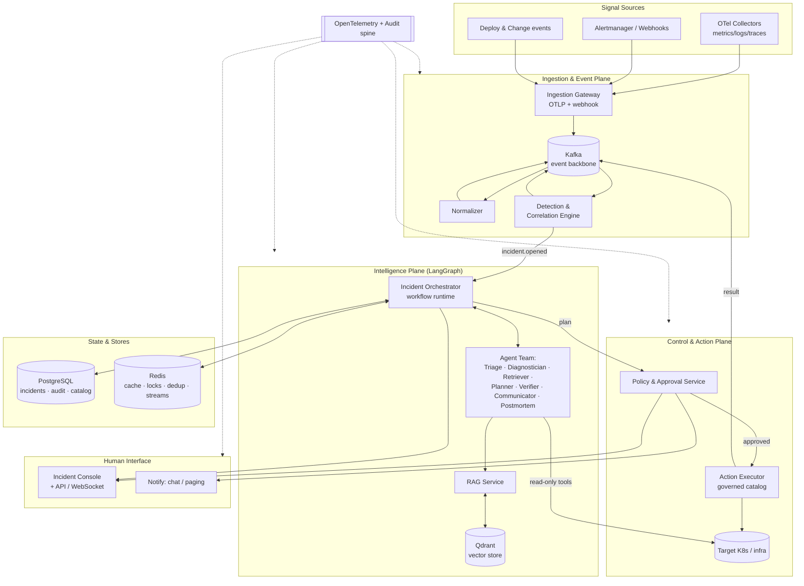
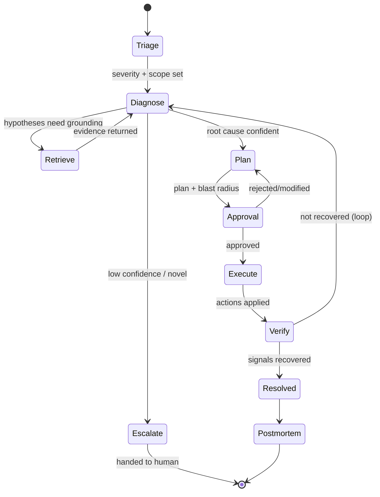

# Aegis — Architecture

**Project:** Aegis — Autonomous Incident Response & Remediation Platform
**Phase:** Architecture & Planning (no implementation)
**Status:** Draft v1.1 (post design review — see §17)
**Date:** 2026-06-19

> Companion docs: `requirements.md` (problem, personas, FRs/NFRs), `roadmap.md` (ranking, phasing, ADRs).

---

## 1. Architectural Principles

1. **Aegis must never make an incident worse.** Safety dominates autonomy. The deterministic path
   (detect → correlate → page) works even if the entire AI tier is down.
2. **Humans command, agents assist.** Consequential actions pass a policy-driven approval gate.
3. **Everything grounded, everything cited.** No agent proposes an action without retrieved evidence.
4. **Idempotency everywhere on the hot path.** At-least-once delivery + idempotent handlers, not
   fragile exactly-once illusions.
5. **Externalize state.** Services are stateless; durable state lives in Postgres/Redis/Kafka/Qdrant so
   any pod can resume any workflow.
6. **The platform observes itself.** Every service and every agent step emits OpenTelemetry spans.
7. **Cloud-agnostic, Kubernetes-first.** Portable workloads behind clean interfaces.

---

## 2. High-Level Architecture

Aegis is decomposed into three planes: an **ingestion/event plane**, an **intelligence (agent) plane**,
and a **control/action plane**, plus a cross-cutting observability/security spine.

**Request/data flow (happy path):** signals → Kafka → normalized → detection correlates into an
`Incident` → `incident.opened` event → Orchestrator spins up a LangGraph workflow → agents investigate
(read-only tools + RAG) → Planner emits a remediation plan → Policy service evaluates risk → human
approves in console (or auto-approve if low-risk) → Action Executor applies the fix idempotently →
Verifier confirms recovery against original signals → Postmortem agent drafts the writeup → corpus
updated. Every hop is traced.

---

## 3. Microservices Decomposition

Boundaries follow **ownership of state + rate of change + blast radius**, not arbitrary layering.

| Service | Responsibility | State owned | Scaling driver |
|---|---|---|---|
| **Ingestion Gateway** | OTLP/webhook intake, auth, backpressure, publish to Kafka | none (stateless) | inbound signal rate |
| **Normalizer** | Map heterogeneous signals → canonical `Signal` | none | partition count |
| **Detection & Correlation** | Anomaly detection, time/topology correlation, incident creation + ownership | detector state in Redis | signal volume |
| **Incident Orchestrator** | LangGraph workflow runtime; drives agent state machine; checkpoints | workflow state in Postgres + Redis | active incidents |
| **Agent Workers** | Execute individual agent nodes / tool calls | none (state passed in) | concurrent agent steps |
| **RAG Service** | Hybrid retrieval, re-ranking, context assembly | none | retrieval QPS |
| **Policy & Approval** | Autonomy policy, risk scoring, approval workflow, RBAC | policies in Postgres | low |
| **Action Executor** | Execute governed actions idempotently w/ rollback | execution ledger in Postgres | remediation rate |
| **Notification** | Fan-out to chat/paging | none | low |
| **Console API / Gateway** | REST + WebSocket for the UI, auth | none | active operators |
| **Knowledge Ingestor** | Embed + upsert docs/postmortems into Qdrant | none | corpus churn |

Services communicate **asynchronously via Kafka** for the event/data flow and **synchronously via
gRPC/REST** only for request-response interactions (console queries, approval calls, tool invocations).

---

## 4. Agent Architecture

The intelligence plane is a **supervised multi-agent system** implemented as a **LangGraph state graph**.
The Orchestrator is the supervisor; specialized agents are nodes. State is an explicit, typed
`IncidentState` object checkpointed after every node, making workflows **durable and resumable** — if a
worker pod dies, another resumes from the last checkpoint.

**Agent roster (responsibilities · tools · memory · inputs · outputs · failure modes):**

- **Triage Agent** — sets severity, affected services, and urgency. *Tools:* service catalog, recent
  deploys, topology graph. *Output:* enriched incident metadata. *Failure mode:* mis-scoping → mitigated
  by deterministic severity floor from detection rules.
- **Diagnostician Agent** — the reasoner; forms and tests root-cause hypotheses. *Tools:* metrics query,
  log search, trace inspection, K8s read (pods/events/HPA), diff of recent changes. *Output:* ranked
  hypotheses + confidence. *Failure mode:* hallucinated cause → mitigated by mandatory citations and a
  confidence threshold gate before planning.
- **Retriever/Knowledge Agent** — runs RAG against runbooks + past incidents. *Tools:* RAG Service.
  *Output:* cited evidence bundle. *Failure mode:* irrelevant retrieval → hybrid search + re-rank + service scoping.
- **Remediation Planner Agent** — maps the diagnosis to an ordered plan from the **governed action
  catalog only**. *Output:* plan with per-step blast radius, reversibility, approval tier. *Failure mode:*
  proposing out-of-catalog actions → structurally impossible (catalog is the tool surface).
- **Verifier Agent** — after execution, re-evaluates the original signals + health checks. *Output:*
  recovered / not-recovered + evidence. *Failure mode:* premature "resolved" → requires signal-level
  confirmation, not just action success.
- **Communicator Agent** — produces human-readable status updates and notifications.
- **Postmortem Agent** — drafts the timeline/RCA/impact writeup and proposes follow-ups.

**Memory strategy (three tiers):**
1. **Working memory** — the `IncidentState` for the current incident (short-term, in-graph, checkpointed).
2. **Episodic memory** — resolved incidents + postmortems embedded in Qdrant; retrieved as "we've seen
   this before" cases (long-term, cross-incident).
3. **Semantic memory** — runbooks, architecture docs, service ownership in Qdrant + Postgres (stable knowledge).

**Tool safety:** during diagnosis all tools are **read-only**; only the Action Executor (outside the
agent sandbox, behind the policy gate) can mutate infrastructure. Agents *request* actions; they never
hold infra credentials.

---

## 5. Distributed Systems Architecture

**Incident ownership (single-driver guarantee).** When detection opens an incident, ownership must be
held by exactly one orchestrator instance to avoid duplicate concurrent remediation.

- A **Redis distributed lock** (single-owner, fenced token, TTL + heartbeat) keyed by `incident_id`
  guards the workflow. The fencing token is checked by the Action Executor so a stale owner whose lock
  expired cannot still apply actions (prevents split-brain on the *dangerous* path).
- Kafka **partitioning by `incident_id`** means all events for an incident land on one partition,
  consumed by one consumer-group member — ordering + locality without global coordination.
- Postgres holds the authoritative incident state; the lock guards *who may advance it*, Postgres row
  versioning (optimistic concurrency) is the final arbiter on writes.

**Idempotency.** Every command carries an idempotency key. The Action Executor maintains an execution
ledger (`(incident_id, step_id, idempotency_key)` unique) so a redelivered "restart deployment" command
is a no-op the second time. Detection dedups signals via Redis (content-hash + window).

**Retries & timeouts.** All cross-service calls have bounded retries with exponential backoff + jitter,
deadline budgets, and **circuit breakers** (notably around the LLM provider and the target K8s API).
Dead-letter topics capture poison messages for human review.

**Failure recovery.** Workflow checkpoints make orchestration crash-tolerant. Action steps are
transactional with **compensating rollback** (saga pattern): if step 3 of 5 fails, previously applied
reversible steps are undone in reverse order, and the incident returns to diagnosis.

**CAP positioning.** The control plane favors **consistency over availability for the action path**
(CP): if Aegis cannot be certain it holds the incident lock and a fresh fencing token, it **will not
execute** — it pages a human instead. The read/observability path favors availability (AP): the console
can show slightly-stale state during a partition rather than block.

**Bottlenecks & mitigations.**
| Bottleneck | Mitigation |
|---|---|
| Signal storm overwhelms detection | Kafka backpressure, partitioned consumers, dedup, sampling, HPA on consumer lag |
| LLM latency/cost spikes | Model tiering, semantic cache (Redis), per-incident budget + circuit breaker |
| Vector search hot-spotting | Qdrant sharding/replication, retrieval cache, service-scoped filters |
| Postgres write contention on audit | Append-only audit via Kafka → batched writer; partition by time |
| Action Executor as global chokepoint | Partition by target cluster/namespace; concurrency caps per blast-radius tier |

---

## 6. Event-Driven Architecture

Kafka is the **single source of truth for "what happened"** and the integration backbone. Services are
loosely coupled producers/consumers; new capabilities subscribe without touching producers.

**Core topics (partition key in brackets):**
- `signals.raw` [source] → `signals.normalized` [service] — ingest pipeline.
- `incidents.lifecycle` [incident_id] — `opened`, `updated`, `plan_proposed`, `approved`, `executing`,
  `verified`, `resolved`, `escalated`. The orchestrator's event-sourced spine.
- `actions.requested` / `actions.result` [incident_id] — command + result events for the executor.
- `knowledge.ingest` [doc_id] — docs/postmortems to embed.
- `notifications.outbound` [incident_id] — fan-out to channels.
- `*.dlq` — dead-letter topics per consumer group.

**Patterns:** **event sourcing** for incident state (the lifecycle topic is the log; Postgres is a
materialized projection); **CQRS** (writes via events, reads served from Postgres/Redis projections);
**transactional outbox** so a service's DB write and its Kafka publish are atomic (no lost or phantom
events); **saga** for multi-step remediation. Delivery is **at-least-once**; consumers are idempotent.
Schemas are governed by a **schema registry** with backward-compatible evolution.

---

## 7. Database Design (PostgreSQL)

Postgres is the system of record for incidents, audit, policy, and the action catalog. Analytics/log-scale
data stays in Kafka/object storage, not Postgres.

**Core tables (abridged):**
- `incidents` — `id`, `status`, `severity`, `services[]`, `opened_at`, `owner_token`, `version` (optimistic lock).
- `signals` — normalized signals linked to incidents (hot partition by time; older rolled to object storage).
- `hypotheses` — per-incident RCA candidates with confidence + evidence refs.
- `plans` / `plan_steps` — proposed remediation, blast radius, approval tier, status.
- `actions_ledger` — executed actions, idempotency key, fencing token, result, rollback ref (append-only).
- `approvals` — who approved/rejected what, when (immutable).
- `action_catalog` — governed actions, parameters, RBAC, risk tier, rollback definition.
- `policies` — autonomy policy per env/service/severity.
- `audit_log` — append-only, immutable, every decision/action with trace_id (partitioned by time).

**Design choices:** optimistic concurrency (`version`) on incident updates; append-only audit/ledger for
tamper-evidence; time-partitioning for high-churn tables; foreign keys + check constraints for integrity;
read replicas for the console/analytics read path (CQRS read side).

---

## 8. Vector Database Strategy (Qdrant)

**Why a dedicated vector DB:** RCA quality depends on retrieving the *right* runbook/past-incident fast,
with metadata filtering (by service, severity, recency) and hybrid (dense + sparse) search. Qdrant is
open-source, K8s-native, supports payload filtering, hybrid search, sharding, and replication.

**Collections:**
- `runbooks` — chunked operational docs; payload: service, system, tags, version, source URL.
- `incidents_episodic` — resolved incidents/postmortems; payload: services, root_cause_class, resolution,
  severity, timestamp. This is the "have we seen this before" memory.
- `architecture_docs` — service design docs, dependency notes, SLOs.

**Indexing & retrieval:** HNSW index; **hybrid search** (dense embeddings + sparse/BM25-style) with a
**re-ranker** on top; **metadata pre-filtering** by affected service and recency so retrieval is scoped,
not global. Chunking is **semantic/structure-aware** (by runbook step / section) with overlap, plus
parent-document retrieval so a matched chunk pulls its full procedure.

**Sharding & scaling:** shard by collection size; replicate for read availability; retrieval results
cached in Redis keyed by `(query_embedding_hash, filters)`. Embeddings produced by an open-source,
Ollama-compatible embedding model behind an interface so the model is swappable.

**Freshness:** the Knowledge Ingestor consumes `knowledge.ingest` and upserts continuously; every
resolved incident is embedded within minutes, so episodic memory is always current (closed loop with FR-4.3).

---

## 9. RAG Strategy

**Goal:** ground every hypothesis and remediation step in the org's own knowledge; eliminate ungrounded
action proposals (FR-4.2).

**Pipeline:**
1. **Query formulation** — the Diagnostician/Retriever turns the incident context (symptoms, services,
   recent changes) into one or more retrieval queries (multi-query expansion).
2. **Hybrid retrieval** — dense + sparse over Qdrant with **service- and recency-scoped metadata filters**.
3. **Re-ranking** — cross-encoder re-ranker selects the top-k most relevant chunks.
4. **Context assembly** — parent-document expansion; de-duplication; token-budget-aware packing; **every
   chunk carries a citation handle**.
5. **Grounded generation** — the agent reasons over retrieved evidence and *must cite*; a post-generation
   **groundedness check** rejects claims/actions not supported by retrieved context (anti-hallucination).
6. **Episodic shortcut** — if a near-duplicate past incident is retrieved with a known good resolution,
   the Planner proposes that resolution directly (with citation), short-circuiting deep RCA for known patterns.

**Anti-prompt-injection:** retrieved content and telemetry are treated as **untrusted data, never
instructions** — separated by role, never able to grant tool/action permissions; the action catalog +
policy gate are the hard boundary regardless of what any document "says."

---

## 10. Agent Communication Strategy

- **Within a workflow:** agents communicate **indirectly through shared, typed `IncidentState`** managed
  by LangGraph (blackboard pattern), not by chatty free-text message passing. This is deterministic,
  inspectable, and checkpointable. The Orchestrator (supervisor) decides routing/transitions.
- **Across services:** **event-driven via Kafka** for lifecycle/async flow; **gRPC** for synchronous
  request-response (tool calls, approval queries) with deadlines.
- **Human-in-the-loop:** LangGraph **interrupt** at the Approval node suspends the durable workflow until
  a human (or auto-policy) responds via the Console API, then resumes from checkpoint — no busy-waiting,
  survives restarts.
- **Concurrency:** independent investigation branches (e.g. query metrics *and* search logs) run in
  parallel within the graph and join before planning, cutting time-to-hypothesis.
- **Contracts:** all inter-agent and inter-service payloads are schema-versioned; tool I/O is typed and validated.

---

## 11. Model Strategy

Per project standards, **open-source / Ollama-compatible models are preferred** and used by default for
embeddings, classification/triage, summarization, and routine steps. A **model-router** behind a single
interface escalates only the hardest RCA reasoning to a larger model when confidence is low, keeping
cost bounded (NFR-8). Benefits: cost control, portability, no hard vendor lock-in, on-prem option for
regulated tenants. The router enforces per-incident token budgets and a semantic cache.

---

## 12. Scaling Strategy

- **Stateless services** (Gateway, Normalizer, RAG, Agent Workers, Console API) scale horizontally via
  Kubernetes **HPA**; agent workers and detection scale on **Kafka consumer lag** (KEDA-style) rather than CPU.
- **Partitioned parallelism:** Kafka partitions bound max consumer parallelism; partition counts sized
  for peak signal rate with headroom.
- **Stateful backends:** Kafka (partitioned/replicated), Postgres (primary + read replicas; read path via
  CQRS projections), Redis (cluster mode), Qdrant (sharded + replicated) — each scaled independently.
- **Multi-level caching:** Redis for retrieval results, semantic LLM cache, service-topology, and dedup.
- **Backpressure & load-shedding:** if downstream saturates, the ingest path buffers in Kafka and the
  detection tier prioritizes high-severity signals; non-critical analytics is shed first.
- **Cost-aware autoscaling:** agent concurrency capped per blast-radius tier and per LLM budget.

---

## 13. Security Strategy

- **Least privilege & scoped action surface:** agents never hold infra credentials; they emit
  *action requests*. The Action Executor uses **short-lived, narrowly-scoped credentials** (per target
  namespace) minted just-in-time, and can only run catalog actions allowed by policy/RBAC.
- **Defense-in-depth on the action path:** policy evaluation → human approval (above low-risk tier) →
  fencing-token check → idempotent execution → automatic rollback → full audit. No single failure leads
  to an unauthorized or unbounded action.
- **Multi-tenancy:** strict tenant isolation across Kafka (topic/ACL), Postgres (row-level security /
  schema-per-tenant), Qdrant (collection/partition), and credentials.
- **Prompt-injection & data-exfiltration resistance:** untrusted-content boundary (§9); egress controls
  on agent tools; secrets never enter prompts or logs; outputs scanned for secret leakage.
- **Secrets & supply chain:** secrets via a secrets manager + CSI; signed images; SBOM; network policies
  (default-deny) between services; mTLS (service mesh) for east-west traffic.
- **AuthN/Z:** OIDC SSO for humans; RBAC for approvals and catalog management; every privileged action attributable.

---

## 14. Observability Strategy

Aegis **dogfoods OpenTelemetry** — fitting for an observability product.

- **Tracing:** OTel spans across every service *and* every agent node, tool call, retrieval, and LLM
  invocation. A single `trace_id` follows an incident from signal ingest → resolution, so an operator
  can replay exactly what each agent saw and did.
- **Metrics (RED + domain):** request rates/errors/durations per service; plus **agentic metrics** —
  time-to-first-hypothesis, RCA accuracy (post-hoc validated), auto-remediation success rate,
  false-action rate, human-override rate, tokens & $ per incident, retrieval relevance.
- **Logs:** structured, correlated to trace_id; agent reasoning traces captured as span events.
- **Backends:** OTel Collector → trace/metric/log stores (Tempo/Prometheus/Loki-style, swappable) +
  dashboards; SLOs with burn-rate alerts — and those alerts feed *back* into Aegis (it can watch itself,
  carefully sandboxed to avoid self-referential loops).
- **Audit & explainability:** the immutable audit log + trace replay make every autonomous decision
  reconstructable for compliance (NFR-9) and trust-building with operators.

---

## 15. Deployment Strategy (Cloud-Agnostic, Kubernetes-First)

- **Packaging:** each service is a container; deployed via **Helm charts** / Kustomize overlays;
  infrastructure (Kafka, Postgres, Redis, Qdrant, OTel stack) provisioned by **operators** and
  **Terraform** modules so the whole stack is reproducible on any conformant Kubernetes (EKS/GKE/AKS/on-prem).
- **Environments:** dev → staging → prod overlays; **staging is also where Aegis' own auto-remediation
  is exercised against fault-injected workloads** before being trusted in prod.
- **Progressive delivery:** GitOps (Argo/Flux-style) with canary/blue-green for Aegis services; remediation
  *targets* are upgraded independently.
- **Resilience:** PodDisruptionBudgets, anti-affinity, multi-AZ; the control plane survives node loss; the
  durable-workflow design means in-flight incidents resume after pod rescheduling.
- **Config & safety:** autonomy policy and the action catalog are versioned config (GitOps-reviewed); a
  global **kill switch** drops Aegis to observe-only instantly.
- **DR:** Kafka + Postgres replicated; periodic backups; documented RPO/RTO; runbooks for Aegis itself.

---

## 16. Key Trade-offs (summary)

| Decision | Chosen | Alternative | Why |
|---|---|---|---|
| Action-path consistency | CP (refuse if unsure) | AP (act optimistically) | Safety: never double-remediate |
| Agent coordination | Supervised graph + shared state | Autonomous free-chat agents | Deterministic, inspectable, cheaper |
| Delivery semantics | At-least-once + idempotent | Exactly-once | Simpler, robust, achievable |
| Models | OSS-first + escalate | Single frontier model | Cost, portability, on-prem |
| State | Externalized + checkpointed | In-memory agents | Crash-tolerant, scalable |
| Remediation | Governed catalog + HITL | Open-ended actions | Bounded blast radius, auditable |
| Incident ownership | Kafka single-consumer + Postgres fencing token | Redis Redlock (v1.0) | Linearizable token; Redlock unsafe for action path (see §17) |

See `docs/adr/` for the full ADR set and `design-review.md` for the review that produced v1.1.

---

## 17. Revision Log — v1.1 (post Staff-Engineer design review)

The following changes supersede the corresponding v1.0 text. Drivers are in `design-review.md`; each maps
to an ADR in `docs/adr/`.

1. **Incident ownership (supersedes §5 + ADR-009).** Single-driver semantics now come from **Kafka
   single-consumer-per-partition** on `incidents.lifecycle[incident_id]`, not a Redis lock. The dangerous-path
   guard is a **monotonic fencing token from a Postgres sequence** (linearizable), re-verified by the
   credential issuer and the executor. Redis is advisory/perf only (dedup, cache) — never a correctness
   primitive. *(ADR-009 revised.)*

2. **Right-sized service topology (supersedes §3).** v1 collapses to ~7 services: Normalizer is merged into
   **Detection & Correlation**; **agents run in-process inside the Orchestrator** (LangGraph), not as a
   separate Agent-Workers service; **Communicator** folds into **Notification**. Event-sourcing/CQRS (§6),
   service mesh (§13), and multi-tenancy (§13) are **deferred** until scale/requirements justify them. The
   **transactional outbox** and **saga rollback** are retained. *(ADR-012 revised, ADR-013.)*

3. **Hardened action path (supersedes §13).** Explicit **PDP/PEP split**; an independent **credential issuer**
   mints scoped, short-lived credentials only after verifying a **signed approval record** (it does not trust
   the executor). Every action parameter is **schema-validated against the catalog**. **Invariant: no LLM
   output can directly trigger an action** — the catalog + approval + fencing token are the only path, and
   the system assumes prompt injection can succeed. Kill switch defaults to **stop-and-hold** (roll-back-then-hold
   on request); catalog + rollback definitions are CI-tested/dry-run. *(ADR-014, ADR-015.)*

4. **Tamper-evident audit (supersedes §7).** The audit log is **hash-chained** (each record commits the prior
   record's hash) and periodically anchored to WORM/object storage, replacing the plain append-only claim. *(ADR-014.)*

5. **Bounded agents (extends §4/§10).** Hard **per-incident budgets** — max diagnose↔verify iterations,
   wall-clock, and tokens/$ — with LLM circuit breakers and mandatory human escalation on exhaustion. *(ADR-017.)*

6. **Honest, precedent-gated autonomy (supersedes §4/§9).** Aegis is framed as a **triage accelerator +
   known-pattern remediator**, not a novel-incident oracle. **Auto-remediation requires a validated precedent
   above a similarity threshold**; **abstention is preferred over guessing**; confidence is **calibrated on
   historical outcomes**; retrieved precedents require corroborating **live** evidence before acceptance.
   RCA quality is measured by **historical-replay eval in CI** (precision/recall + abstention), replacing the
   "beats human baseline" metric. *(ADR-016.)*

7. **Correlation specified (supersedes §3 detection box + §5).** Correlation is treated as a **stateful
   streaming join** (Kafka Streams / Flink keyed state), starting **deterministic** (topology-edge + time-window
   + signal-type rules) before any ML. Hot partitions (hub services, large namespaces) are **salted/sub-keyed**;
   per-namespace remediation concurrency is **capped**; signal storms are **deterministically pre-summarized**
   before entering agent context. *(ADR-018.)*

8. **Cost discipline (extends §12).** **Retention tiering** for signals/traces (short hot TTL in Kafka,
   sampled cold to object storage); backends right-sized and swappable to managed offerings; hybrid/re-rank
   gated on measured retrieval gain. *(ADR-020.)*

9. **Aegis reliability isolation (supersedes §14/§15).** Aegis runs in a **separate failure domain** from the
   systems it remediates; the **human paging path never transits the AI tier**; it degrades safe to
   deterministic paging; **self-remediation is removed in v1** (Aegis is watched by a separate, simpler
   monitor). *(ADR-019.)*
